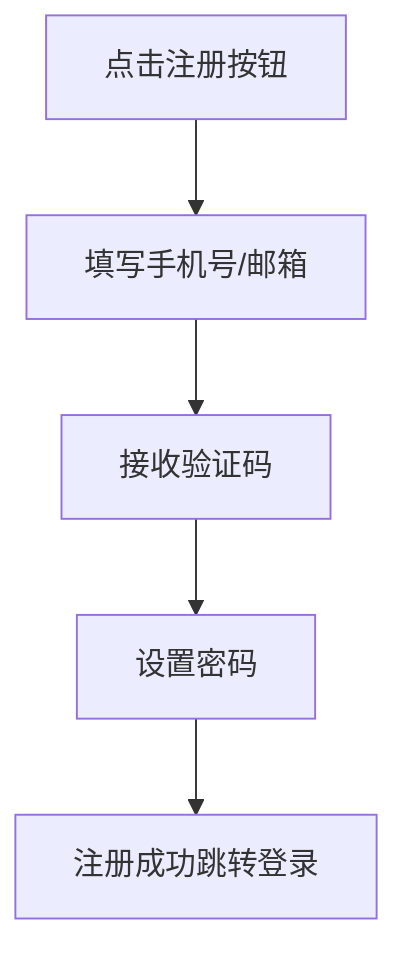

# PRD模板

## 一、文档概述

| 字段         | 内容示例                |
| ------------ | ----------------------- |
| 文档名称     | [产品/功能名称]需求文档 |
| 作者         | 产品经理 [姓名]         |
| 创建时间     | 2025年X月X日            |
| 当前版本     | v1.0                    |
| 相关版本记录 | 版本号                  |
|              | v0.1                    |

## 二、产品目标与背景

### 2.1 背景说明

- 简述项目来源、业务痛点、用户诉求或竞品状况
- *示例：当前用户系统注册登录入口分散，信息冗余，缺乏统一的账号体系。为提升用户体验和账号安全性，需搭建统一的用户中心模块。*

### 2.2 产品目标

- 实现统一用户注册、登录、找回密码功能
- 支持手机号 + 邮箱登录方式
- 对接第三方 OAuth（微信/钉钉）
- 后台支持用户信息管理与禁用

## 三、用户与使用场景

### 3.1 用户角色

| 角色     | 描述                   |
| -------- | ---------------------- |
| 普通用户 | 使用系统的个人账号     |
| 管理员   | 拥有后台管理权限       |
| 访客用户 | 未登录但可访问部分内容 |

### 3.2 使用场景

- 用户进入系统后首次注册并绑定手机号
- 用户忘记密码，通过邮箱找回
- 管理员在后台查询用户信息并禁用账号

## 四、功能清单

| 编号 | 功能名称     | 描述                            | 优先级 |
| ---- | ------------ | ------------------------------- | ------ |
| F-01 | 用户注册     | 支持手机号/邮箱注册             | 高     |
| F-02 | 用户登录     | 支持手机号/邮箱/验证码/密码登录 | 高     |
| F-03 | 找回密码     | 支持通过邮箱或短信重置密码      | 高     |
| F-04 | 用户资料管理 | 昵称、头像、手机号等信息修改    | 中     |
| F-05 | 第三方登录   | 微信扫码登录（OAuth 2.0）       | 中     |

*建议功能按 Must / Should / Could 分类整理，方便优先级管理。*

## 五、功能流程图

## 六、页面说明与交互细节

### 页面 1：注册页

- **入口**：点击"注册"按钮

- 字段说明

  ：

  - 手机号：必填，11位数字
  - 验证码：6位，校验格式
  - 密码：不少于8位，需含字母+数字

- 校验规则

  ：

  - 实时校验手机号是否合法
  - 验证码发送后60s内不可重复发送

- 交互逻辑

  ：

  - 点击注册时校验所有字段
  - 错误提示浮动提示框，3s后消失

## 七、业务规则与边界条件

| 编号 | 内容                             |
| ---- | -------------------------------- |
| R1   | 同一手机号24小时内注册次数≤3次   |
| R2   | 重复注册用户提示"该账号已存在"   |
| R3   | 邮箱格式校验需符合RFC标准        |
| R4   | 第三方账号首次登录即自动注册用户 |

## 八、数据结构（选填）

| 表名  | 字段名     | 类型     | 描述               |
| ----- | ---------- | -------- | ------------------ |
| users | user_id    | string   | 用户唯一ID         |
| users | phone      | string   | 手机号（加密存储） |
| users | email      | string   | 邮箱地址           |
| users | password   | string   | 加密密码（hash）   |
| users | status     | int      | 0正常，1禁用       |
| users | created_at | datetime | 注册时间           |

## 九、埋点与数据指标

| 埋点位置   | 埋点事件名            | 上报字段        |
| ---------- | --------------------- | --------------- |
| 注册页面   | user_register_start   | 无              |
| 注册成功页 | user_register_success | user_id, source |
| 登录页面   | user_login_start      | 无              |
| 登录成功页 | user_login_success    | user_id, method |

## 十、非功能需求

### 10.1 性能需求

- 响应时间：关键操作响应时间<2s
- 系统容量：支持10万并发用户

### 10.2 安全性

- 数据加密：敏感信息加密存储
- 用户认证：登录失败5次锁定账号30分钟

### 10.3 兼容性

- 浏览器：Chrome、Firefox、Safari最新版本
- 移动端：iOS 12+，Android 8.0+

## 十一、验收标准

| 验收项目   | 验收条件                    | 验收方法   |
| ---------- | --------------------------- | ---------- |
| 用户注册   | 手机号/邮箱注册成功，可登录 | 手动测试   |
| 第三方登录 | 微信登录成功，自动注册用户  | 手动测试   |
| 密码找回   | 通过邮箱/短信重置密码成功   | 自动化测试 |

